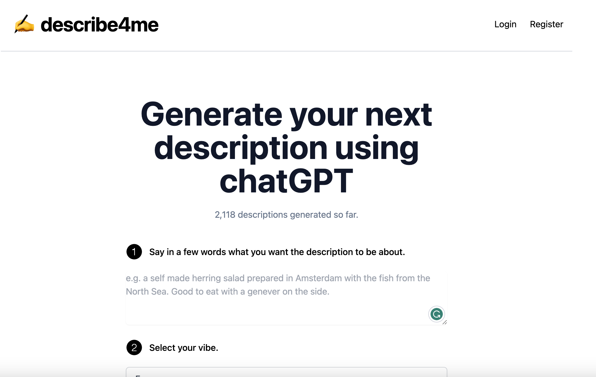

# ✍️ Describe4me

This project generates descriptions for you using AI.

## Goal

The goal of this project is to show you how easy it is to make a web/mobile app that uses AI.

## How it works

This project uses the [ChatGPT API](https://openai.com/api/) and [Vercel Edge functions](https://vercel.com/features/edge-functions) with streaming.

If you want, you can distribute this to the Apple store and Google Play store quickly and easily following the [Capacitor docs](https://capacitorjs.com/docs/).

It is based on my [starter project](https://github.com/RobSchilderr/capacitor-supertokens-nextjs-turborepo), which is a project for building a web application with Next.js, Tailwind CSS, and Supertokens for authentication and session management, as well as a mobile application using Capacitor.

## How to use

For more info how to use this project, please read the [README.md](https://github.com/RobSchilderr/capacitor-supertokens-nextjs-turborepo) in the starter project.

If you want to see the result of the authentication, go to /login-result
